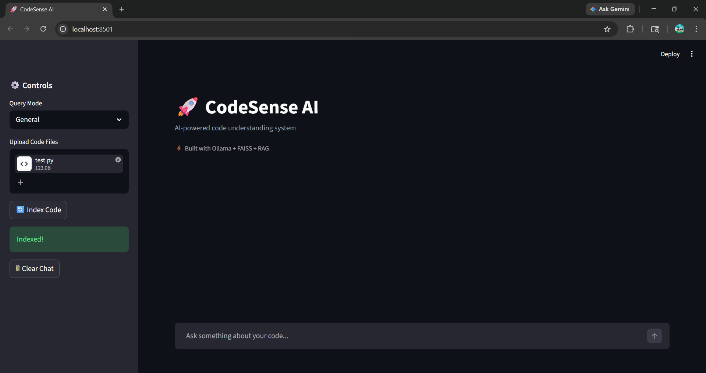
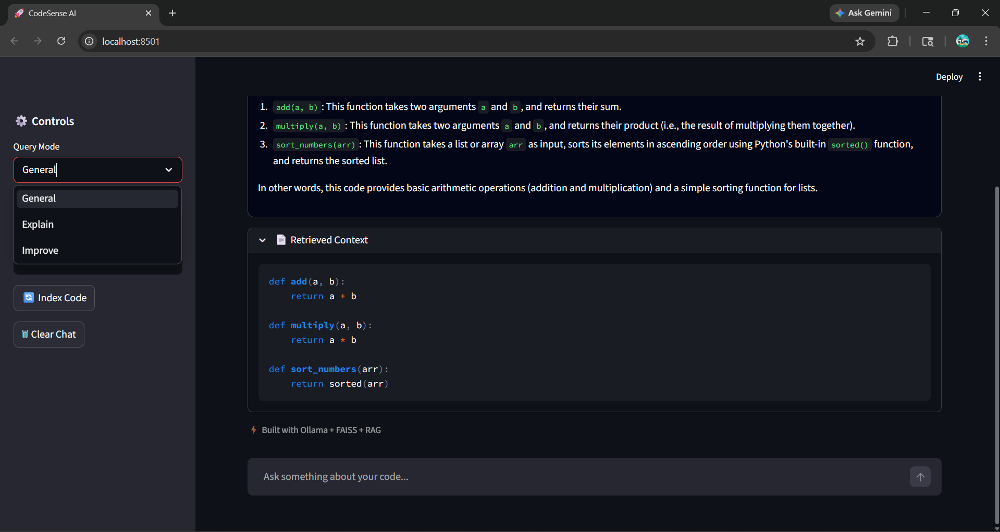
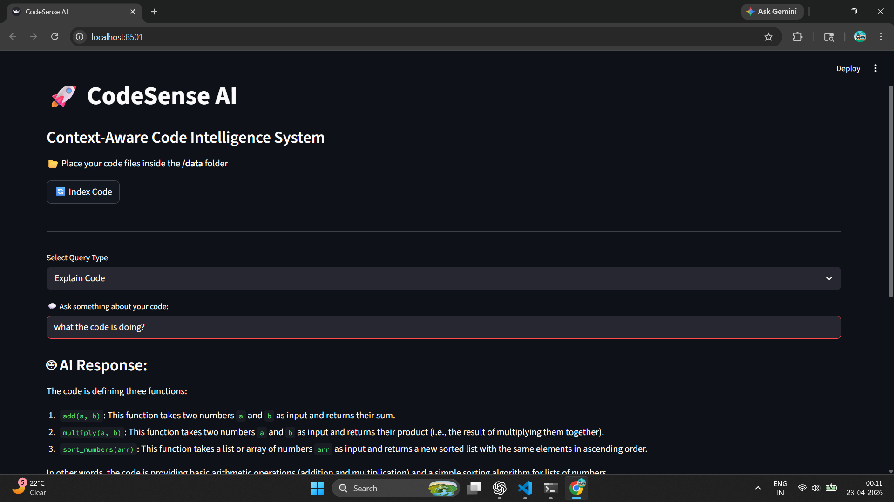

# 🚀 CodeSense AI

### Context-Aware Code Intelligence System (RAG + Local AI)

---

## 🌟 Overview

**CodeSense AI** is an intelligent developer tool that enables users to interact with their codebase using natural language. It leverages **Retrieval-Augmented Generation (RAG)** to provide context-aware answers, explanations, and improvement suggestions for code.

Unlike traditional code assistants, this system retrieves **relevant code snippets using vector embeddings**, ensuring accurate and grounded responses instead of hallucinated outputs.

---

## 🎯 Key Features

* 🔍 **Semantic Code Search**
  Find relevant logic in large codebases using meaning, not keywords.

* 🧠 **Context-Aware Code Explanation**
  Understand functions, modules, and entire workflows.

* ⚡ **Code Improvement Suggestions**
  Get optimization tips, bug detection, and best practices.

* 📂 **Dynamic File Upload**
  Upload your own codebase and instantly analyze it.

* 💬 **Chat-Based Interaction**
  Multi-turn conversation with memory.

* 📄 **RAG Transparency**
  View retrieved code chunks used to generate responses.

* 🎨 **Syntax Highlighting**
  Language-aware rendering for better readability.

---

## 🏗️ System Architecture

```
User Query
   ↓
Embedding Model (Sentence Transformers)
   ↓
Vector Search (FAISS)
   ↓
Top-K Relevant Code Chunks
   ↓
LLM (Ollama - Local)
   ↓
Context-Aware Response
```

---

## 🧠 How It Works

1. Code files are uploaded and split into smaller chunks
2. Each chunk is converted into vector embeddings
3. Embeddings are stored in a vector database (FAISS)
4. User query is also converted into an embedding
5. System retrieves most relevant code snippets
6. Retrieved context is passed to LLM for final response

👉 This ensures responses are **grounded in actual code**, not guesses.

---

## ⚙️ Tech Stack

| Component  | Technology               |
| ---------- | ------------------------ |
| LLM        | Ollama (LLaMA 3 - Local) |
| Embeddings | Sentence Transformers    |
| Vector DB  | FAISS                    |
| Framework  | Streamlit                |
| Language   | Python                   |

---

## 🚀 Installation & Setup

### 1. Clone Repository

```bash
git clone <your-repo-link>
cd CodeSense-AI
```

### 2. Create Virtual Environment

```bash
python -m venv venv
venv\Scripts\activate
```

### 3. Install Dependencies

```bash
pip install streamlit langchain langchain-community sentence-transformers faiss-cpu
```

### 4. Install Ollama

Download from: https://ollama.com/

Run:

```bash
ollama run llama3
```

---

## ▶️ Run the Application

```bash
streamlit run app.py
```

---

## 📸 Demo
“Below are real screenshots of the system in action demonstrating retrieval-based reasoning and context-aware responses.”

## 📸 Demo

### 🔹 Main Interface


### 🔹 Query Modes


### 🔹 AI Response


### 🔹 Retrieved Context

---

## 💡 Example Queries

* “Explain this code”
* “Where is sorting implemented?”
* “How can this code be improved?”
* “What does this function do?”

---

## 🔥 Why This Project Stands Out

* Implements **RAG pipeline (industry-level concept)**
* Uses **local LLM (no API dependency)**
* Demonstrates **vector search + semantic retrieval**
* Includes **transparent reasoning (retrieved chunks)**
* Built as a **real usable tool, not just a demo**

---

## ⚠️ Note on Endee Integration

This project was inspired by and structured around **vector database-based retrieval systems like Endee**.
Due to system-level dependencies in Endee, FAISS is used for local prototyping while maintaining the same architectural principles.

---

## 🚀 Future Improvements

* GitHub repository integration
* Multi-language support
* Code summarization dashboard
* Deployment as web app

---

## 👨‍💻 Author

**Piradi Samuel Sudharshan**

* GitHub: https://github.com/SamuelSudharshan

---

## ⭐ If you like this project, consider starring the repo!
